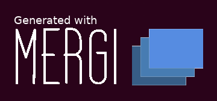
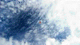

<p>
  
</p>

Result                    | Terminal Code
-----------------------------------|------------------------------------------
 | `mergi -t TT -i https://raw.githubusercontent.com/ashleymcnamara/gophers/master/Facepalm_Gopher.png -r "131 131" -i https://raw.githubusercontent.com/ashleymcnamara/gophers/master/Facepalm_Picard_Gopher.png -r "131 131" -a "sprite 50"`

[](https://godoc.org/github.com/noelyahan/mergi)
[](https://travis-ci.com/noelyahan/mergi)
[](https://codecov.io/gh/noelyahan/mergi)
[](https://goreportcard.com/report/github.com/noelyahan/mergi)
[](https://t.me/joinchat/IzEQ3xEXCiRCh8L2q6pTLg)

## :tada: Basic Overview

Image manipulation [<b>go library</b>](http://godoc.org/github.com/noelyahan/mergi) plus [<b>cross platform CLI tool</b>](https://github.com/noelyahan/mergi/tree/master/cmd/mergi).

## ⚡ Features

- 🛠 Merge
- ✂️ Crop
- 💣 Resize
- 🖃 Watermark
- 💖 Animate
- 🔥 Easing
- 🦎 Transition

<br />

## 🚀 Getting started

### Install via `go get`

To install Mergi, use `go get`, or download the binary file from [Releases](https://github.com/noelyahan/mergi/releases) page.

```bash
$ go get github.com/noelyahan/mergi
```

Usage:

```
 ╔╦╗╔═╗╦═╗╔═╗╦
 ║║║║╣ ╠╦╝║ ╦║
 ╩ ╩╚═╝╩╚═╚═╝╩
 let's go & make imaging fun
 http://mergi.io
 version 1.0.0

  -a string
    	Enter animation type=[sprite, slide] and the delay to get mergi gif animation ex: smooth 10
  -c value
    	Enter crop points and height and width ex: x y w h
  -f string
    	Enter true if you want to process the final output
  -i value
    	Enter images that want to merge ex: /path/img1 or url
  -o string
    	Enter image outputs file ex: out.png or out.jpg (default "out.png")
  -r value
    	Enter resize width and height of the output ex: 100 200
  -t string
    	Enter a merge template string ex: TBTBTB (default "T")
  -w value
    	Enter watermark image and points to place it, [-r w h] is optional  ex: /path/img -r w h x y

```
<br />

#### 🛠 Merge

Image 1                     | Image 2                               | Result Image
-----------------------------------|-------------------------------------------|------------------------------------------
|  | 
|  | 

##### `Mergi Tool`
###### Horizontal 
```bash
mergi \
-t TT \
-i testdata/mergi_bg_1.png \
-i testdata/mergi_bg_2.png
```

###### Vertical 
```bash
mergi \
-t TB \
-i testdata/mergi_bg_1.png \
-i testdata/mergi_bg_2.png
```
##### `Mergi Library`
```go
image1, _ := mergi.Import(io.NewFileImporter("./testdata/mergi_bg_1.png"))
image2, _ := mergi.Import(io.NewFileImporter("./testdata/mergi_bg_2.png"))

horizontalImage, _ := mergi.Merge("TT", []image.Image{image1, image2})
mergi.Export(io.NewFileExporter(horizontalImage, "horizontal.png"))

verticalImage, _ := mergi.Merge("TB", []image.Image{image1, image2})
mergi.Export(io.NewFileExporter(verticalImage, "vertical.png"))
```


<br />

#### ✂️ Crop
Image                    | Result Image
-----------------------------------|------------------------------------------
 | 

##### `Mergi Tool`
```bash
mergi \
-i testdata/mergi_bg_1.png \
-c "10 40 200 110"
```

##### `Mergi Library`
```go
img, _ := mergi.Import(io.NewFileImporter("./testdata/mergi_bg_1.png"))
res, _ := mergi.Crop(img, image.Pt(10, 40), image.Pt(200, 110))
mergi.Export(io.NewFileExporter(res, "crop.png"))
```

<br />

#### 💣 Resize
Image                    | Result Image
-----------------------------------|-------------------------------------------
  | 

##### `Mergi Tool`
```bash
mergi \
-i testdata/mergi_bg_1.png \
-r "180 80"
```

##### `Mergi Library`
```go
img, _ := mergi.Import(io.NewFileImporter("./testdata/mergi_bg_1.png"))
res, _ := mergi.Resize(img, uint(180), uint(80))
mergi.Export(io.NewFileExporter(res, "resize.png"))
```

<br />

#### 🖃 Watermark
Image                   | Watermark Image                             | Result Image
-----------------------------------|-------------------------------------------|------------------------------------------
 |  | 

##### `Mergi Tool`
```bash
mergi \
-i testdata/mergi_bg_1.png \
-w "testdata/mergi_logo_watermark_90x40.png 250 10"
```

##### `Mergi Library`
```go
originalImage, _ := mergi.Import(io.NewFileImporter("./testdata/mergi_bg_1.png"))
watermarkImage, _ := mergi.Import(io.NewFileImporter("./testdata/glass-mergi_logo_watermark_90x40.jpg"))

res, _ := mergi.Watermark(watermarkImage, originalImage, image.Pt(250, 10))
mergi.Export(io.NewFileExporter(res, "watermark.png"))
```

<br />

#### 💖 Animate
Image 1                     | Image 2                               | Result Animation
-----------------------------------|-------------------------------------------|------------------------------------------
 |  | 
 |  | 

##### `Mergi Tool`
###### Sprite Animation 
```bash
mergi \
-t "TT" \
-i testdata/mergi_bg_1.png \
-i testdata/mergi_bg_2.png \
-a "sprite 50"
```
###### Smooth Animation
```bash
mergi \
-t "TT" \
-i testdata/mergi_bg_1.png \
-i testdata/mergi_bg_2.png \
-a "smooth 5"
```

##### `Mergi Library`
```go
image1, _ := mergi.Import(io.NewFileImporter("./testdata/mergi_bg_1.png"))
image2, _ := mergi.Import(io.NewFileImporter("./testdata/mergi_bg_2.png"))

gif, _ := mergi.Animate([]image.Image{image1, image2}, 50)
mergi.Export(io.NewAnimationExporter(gif, "out.gif"))
```

<br />

#### 🔥 Easing

[]()                   | []() | []() | []()
-----------------------|----------------------|----------------------|----------------------
<br/><center>InBounce</center> | <br/><center>InBack</center> | <br/><center>InOutQuad</center> | <br/><center>InSine</center>
<br/><center>InCubic</center> | <br/><center>InElastic</center> | <br/><center>InOutExpo</center> | <br/><center>Linear</center>
<br/><center>InOutBounce</center> | <br/><center>InCirc</center> | <br/><center>InOutCubic</center> | <br/><center>InOutQuart</center>
<br/><center>InOutBack</center> | <br/><center>InCubic</center> | <br/><center>InOutCirc</center> | <center>InOutSine</center>
<br/><center>InExpo</center> | <br/><center>OutBounce</center> | <br/><center>InQuint</center>

##### `Mergi Library`

`Note: Ease function can be applied with any function, in this example it's applied with Watermark function`
```go
// Load background and the square images
square, _ := mergi.Import(io.NewFileImporter("./testdata/square.jpg"))
bg, _ := mergi.Import(io.NewFileImporter("./testdata/white_bg.jpg"))

// Init images frames to add applied ease frames
frames := make([]image.Image, 0)

// Init the limts of the Ease
to := bg.Bounds().Max.X - square.Bounds().Max.X
posY := bg.Bounds().Max.Y/2 - square.Bounds().Max.Y/2
speed := 4

// Ease from 0 to width of background
for i := 0; i < to; i += speed {
  // Apply Easeing function InBounce
  v := Ease(float64(i), float64(to), 0, InBounce)
  img, _ := mergi.Watermark(square, bg, image.Pt(int(v), posY))
  frames = append(frames, img)
}

// For preview example, save as a gif
gif, _ := mergi.Animate(frames, 1)
mergi.Export(io.NewAnimationExporter(gif, "out.gif"))
```


<br />

#### 🦎 Transition

[]()                   | []() | []() | []()
-----------------------|----------------------|----------------------|----------------------
<br/><center>SlideBar</center> | <br/><center>Ink1</center> | <br/><center>Ink2</center> | <br/><center>Ink3</center>
<br/><center>ScaleUpFastRect</center> | <br/><center>ScaleDownFastRect</center> | <br/><center>ScaleUpFastCircle</center> | <br/><center>ScaleDownFastCircle</center>


Learn more [examples](examples)

## 💻 Contribute

- Clone the repository
```bash
$ go get github.com/noelyahan/mergi
```
- Run unit tests
- Fix bug
- Add new feature
- Push

<br />

### 🌠 Contributors

  <!-- ALL-CONTRIBUTORS-LIST:START - Do not remove or modify this section -->

| [<br /><sub>Noel</sub>](https://twitter.com/noelyahan)<br />💻 📖 💬 👀 🤔 🎨 |
| :--------------------------------------------------------------------------------------------------------------------------------------------------------------------------: | 

<!-- ALL-CONTRIBUTORS-LIST:END -->
<br/>

This project follows the [all-contributors](https://github.com/kentcdodds/all-contributors) specification.
Contributions of any kind are welcome!

<br />

### 🔵 License

This project is licensed under the MIT License - see the [LICENSE.md](LICENSE.md) file for details
