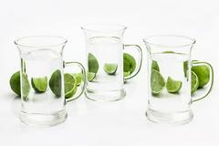
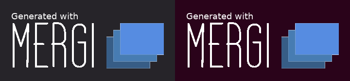
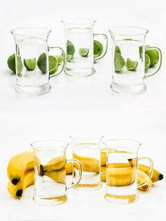
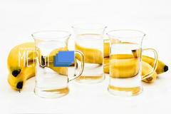
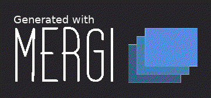

## :tada: Basic Overview

Image manupulation [<b>go library</b>](http://godoc.org/github.com/noelyahan/mergi) plus [<b>cross platform CLI tool</b>](https://github.com/noelyahan/mergi/tree/master/cmd/mergi).

## ⚡ Features

- 🛠 Merge
- ✂️ Crop
- 💣 Resize
- 🖃 Watermark
- 💖 Animate

<br />

## 🚀 Getting started

### Install via `go get`

To install Mergi, use `go get`, or download the binary file from [Releases](https://github.com/noelyahan/mergi/releases) page.

```bash
$ go get github.com/noelyahan/mergi
```

Usage:

```
 ╔╦╗╔═╗╦═╗╔═╗╦
 ║║║║╣ ╠╦╝║ ╦║
 ╩ ╩╚═╝╩╚═╚═╝╩
 let's go & makes imagine fun
 http://mergi.io
 version 1.0.0

  -a string
    	Enter animation type=[sprite, slide] and the delay to get mergi gif animation ex: smooth 10
  -c value
    	Enter crop points and height and width ex: x y w h
  -f string
    	Enter true if you want to process the final output
  -i value
    	Enter images that want to merge ex: /path/img1 or url
  -o string
    	Enter image outputs file ex: out.png or out.jpg (default "out.png")
  -r value
    	Enter resize width and height of the output ex: 100 200
  -t string
    	Enter a merge template string ex: TBTBTB (default "T")
  -w value
    	Enter watermark image and points to place it, [-r w h] is optional  ex: /path/img -r w h x y

```
<br />

#### 🛠 Merge

Image 1                     | Image 2                               | Result Image
-----------------------------------|-------------------------------------------|------------------------------------------
|  | 
|  | 

##### `Mergi Tool`
###### Horizontal 
```bash
mergi \
-t TT \
-i testdata/glass-3306625_240_160.jpg \
-i testdata/glass-3306662_240_160.jpg
```

###### Vertical 
```bash
mergi \
-t TB \
-i testdata/glass-3306625_240_160.jpg \
-i testdata/glass-3306662_240_160.jpg
```
##### `Mergi Library`
```go
image1, _ := mergi.Import(loader.NewFileImporter("./testdata/glass-3306625_240_160.jpg"))
image2, _ := mergi.Import(loader.NewFileImporter("./testdata/glass-3306662_240_160.jpg"))

horizontalImage, _ := mergi.Merge("TT", []image.Image{image1, image2})
mergi.Export(loader.NewFileExporter(horizontalImage, "horizontal.png"))

verticalImage, _ := mergi.Merge("TB", []image.Image{image1, image2})
mergi.Export(loader.NewFileExporter(verticalImage, "vertical.png"))
```


<br />

#### ✂️ Crop
Image                    | Result Image
-----------------------------------|------------------------------------------
 | 

##### `Mergi Tool`
```bash
mergi \
-i testdata/glass-3306662_240_160.jpg \
-c "0 0 120 160"
```

##### `Mergi Library`
```go
img, _ := mergi.Import(loader.NewFileImporter("./testdata/glass-3306662_240_160.jpg"))
res, _ := mergi.Crop(img, image.Pt(0, 0), image.Pt(120, 160))
mergi.Export(loader.NewFileExporter(res, "crop.png"))
```

<br />

#### 💣 Resize
Image                    | Result Image
-----------------------------------|-------------------------------------------
 | 

##### `Mergi Tool`
```bash
mergi \
-i testdata/glass-3306662_240_160.jpg \
-r "80 120"
```

##### `Mergi Library`
```go
img, _ := mergi.Import(loader.NewFileImporter("./testdata/glass-3306662_240_160.jpg"))
res, _ := mergi.Resize(img, uint(80), uint(120))
mergi.Export(loader.NewFileExporter(res, "resize.png"))
```

<br />

#### 🖃 Watermark
Image                   | Watermark Image                             | Result Image
-----------------------------------|-------------------------------------------|------------------------------------------
 |  | 

##### `Mergi Tool`
```bash
mergi \
-i testdata/glass-3306662_240_160.jpg \
-w "testdata/mergi_logo_watermark_90x40.png 20 60"
```

##### `Mergi Library`
```go
originalImage, _ := mergi.Import(loader.NewFileImporter("./testdata/glass-3306662_240_160.jpg"))
watermarkImage, _ := mergi.Import(loader.NewFileImporter("./testdata/glass-mergi_logo_watermark_90x40.jpg"))

res, _ := mergi.Watermark(watermarkImage, originalImage, image.Pt(20, 60))
mergi.Export(loader.NewFileExporter(res, "watermark.png"))
```

<br />

#### 💖 Animate
Image 1                     | Image 2                               | Result Animation
-----------------------------------|-------------------------------------------|------------------------------------------
 |  | 
 |  | 

##### `Mergi Tool`
###### Sprite Animation 
```bash
mergi \
-t "TT" \
-i testdata/glass-3306625_240_160.jpg \
-i testdata/glass-3306662_240_160.jpg \
-a "sprite 50"
```
###### Smooth Animation
```bash
mergi \
-t "TT" \
-i testdata/glass-3306625_240_160.jpg \
-i testdata/glass-3306662_240_160.jpg \
-a "smooth 5"
```

##### `Mergi Library`
```go
image1, _ := mergi.Import(loader.NewFileImporter("./testdata/glass-3306625_240_160.jpg"))
image2, _ := mergi.Import(loader.NewFileImporter("./testdata/glass-3306662_240_160.jpg"))

gif, _ := mergi.Animate([]image.Image{image1, image2}, 50)
mergi.Export(loader.NewAnimationExporter(gif, "out.gif"))
```

<br />

Learn more [examples](examples)

## 💻 Contribute

- Clone the repository
```bash
$ go get github.com/noelyahan/mergi
```
- Run unit tests
- Fix bug
- Add new feature
- Push

<br />

### 🌠 Contributors

  <!-- ALL-CONTRIBUTORS-LIST:START - Do not remove or modify this section -->

| [<br /><sub>Noel</sub>](https://twitter.com/noelyahan)<br />💻 📖 💬 👀 🤔 🎨 |
| :--------------------------------------------------------------------------------------------------------------------------------------------------------------------------: | 

<!-- ALL-CONTRIBUTORS-LIST:END -->
<br/>
This project follows the [all-contributors](https://github.com/kentcdodds/all-contributors) specification.
Contributions of any kind are welcome!

<br />

### 🔵 License

This project is licensed under the MIT License - see the [LICENSE.md](LICENSE.md) file for details
